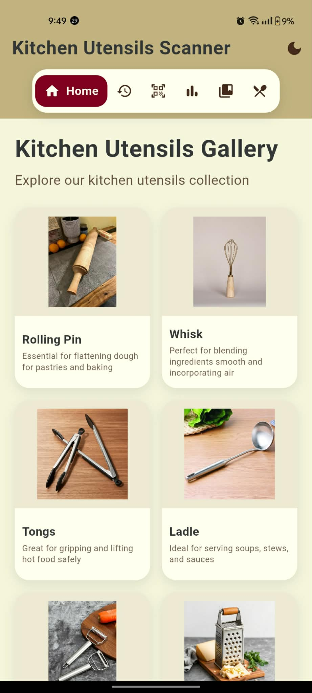
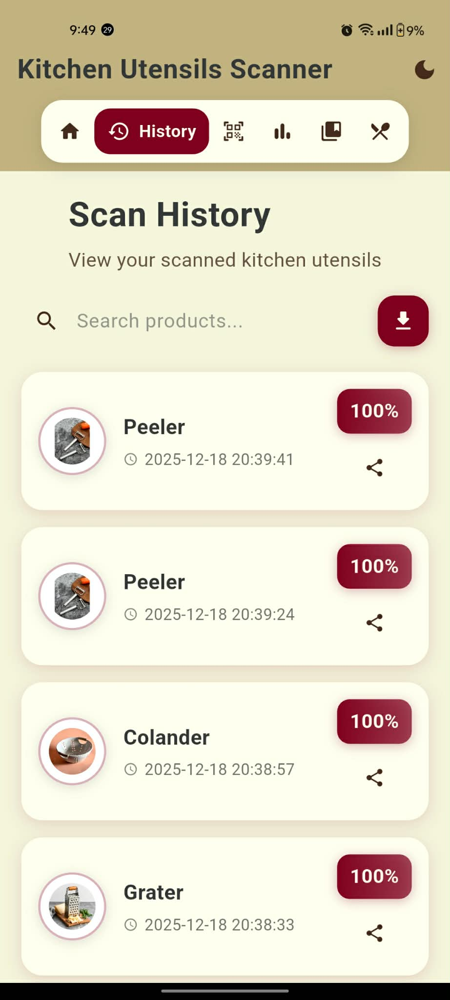
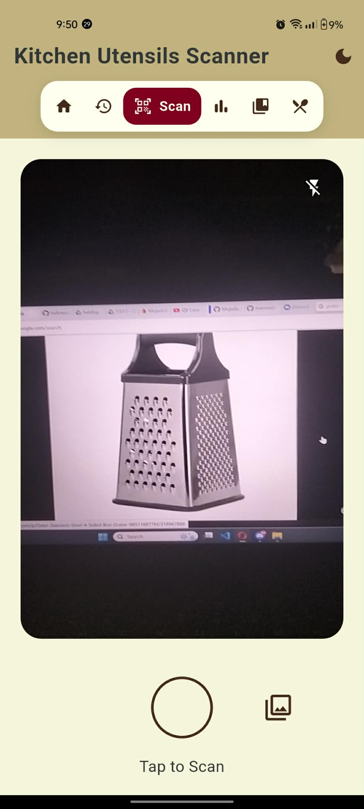
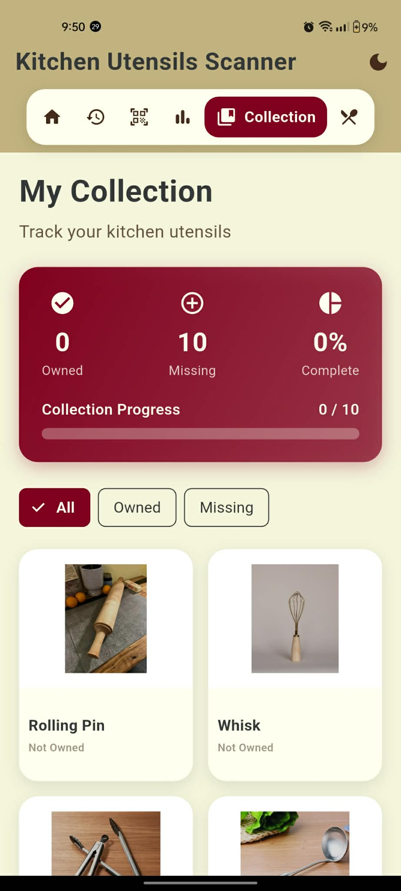
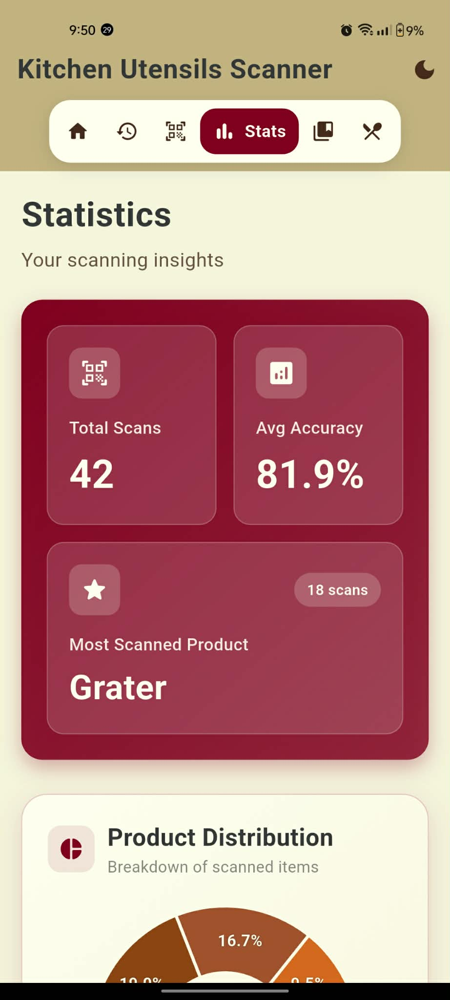
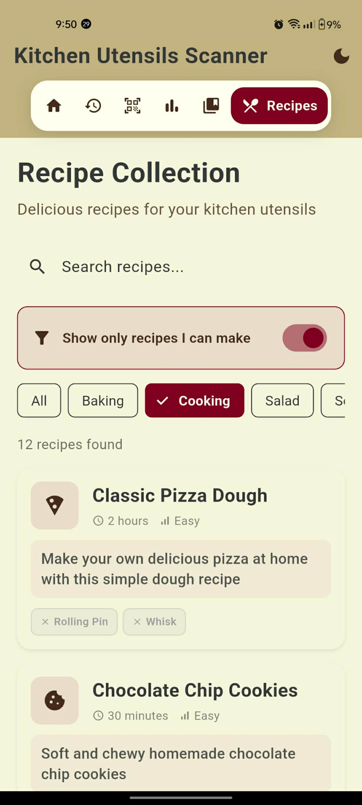

# Hello 👋, I'm **Rica Gin A. Mojado**

### 📚 BSIT Student | Aspiring Web & System Developer  
📌 Student at Caraga State University - Cabadbaran Campus  

🌱 Currently learning and building systems using **Web Development, PHP, Flutter, and Machine Learning**.  
🤝 Open to collaborating on impactful and innovative projects.

---

# 📱 Kitchen Utensils 

This Flutter app is a **Kitchen Utensils Identification System** designed to help users recognize various kitchen tools using image classification technology. The application uses **Teachable Machine models** to identify utensils through image scanning and provide relevant information such as:

- Utensil name  
- Accuracy percentage  
- Possible similar items  
- Related recipes  

The main goal of this project is to assist users, beginners, students, and culinary learners in identifying kitchen utensils accurately and quickly, especially when they are unfamiliar with certain tools. This can help in **cooking, learning, organizing, and understanding different utensils used in the kitchen**.

The app consists of **six main screens**:  
🏠 Home • 🕒 History • 🔍 Scanner • 📚 Collection • 📊 Analytics  • 🍲 Recipe Collection 

---

## 🏠 Home Screen
**Full Description:**  
The **Home Screen** serves as the main landing page of the app. It displays the introduction section, featured content, descriptions, featured items, and options to interact with the system.

**Users can:**
- View item descriptions  
- Navigate to other pages  
- Add items directly to the **Collection**  
- Access scanning and recipes easily  
- See a preview of content generated by the app  

**Screenshot:**  

---

## 🕒 History Screen
**Full Description:**  
The **History Screen** records everything the user has done inside the app.

**This includes:**
- Items previously scanned  
- Items added to the collection  
- Past results with similarity percentage  
- Previously viewed recipes
- Download the history you wanted

**Purpose:**  
- Allows the user to track past activity  
- Helps the user find scanned items without rescanning  
- Makes the app more organized and user-friendly  

**Screenshot:**  

---

## 🔍 Scanner Screen
**Full Description:**  
The **Scanner Screen** uses your Teachable Machine model to determine the **confidence level** of scanned items. Additional for the Image Picker that can choose any photo that can determine the **confidence level** and the similarities of scanned items.

**The system can show:**
- **100% Match** (exact class identified)  
- **80–99% Similar** to another class  
- **Suggested related classes**  

After scanning, the app displays:
- Identified item  
- Accuracy percentage  
- Description  
- Possible classifications  
- Option to **Add to Collection**  
- Option to **View Recipe**  

**Screenshot:**  

---

## 📚 Collection Screen
**Full Description:**  
The **Collection Screen** stores all items the user has saved from:
- Home Screen  
- Scanner Screen  
- Recipe Screen  

It acts as a personal library where users can:
- Browse saved items  
- Open item details  
- Access recipes  
- Manage the content they added
- Show Missing and Owned

**Screenshot:**  

---

## 📊 Statistics Screen
**Overview:**  
Analytics provide insights into user interactions with the app, helping monitor usage patterns, track progress, and identify popular items.

**Features:**
Show Most scanned Product, Avg Accuracy, Total Scans and Product Distribution
- **Scan Progress:** Shows the percentage of items scanned by the user  
- **Image Picker Usage:** Tracks how often users pick images to scan recipes  
- **Overall Completion:** Displays the percentage of total recipes added to the collection  
- **Top Item:** Highlights the most scanned or most used recipe/item  
- **Trends:** Provides insights into popular items across all users  
- **Completion Stats:** Visual representation of personal vs overall collection completion
  

**Screenshot:**  

---

## 🍲 Recipe Collection
**Overview:**  
The **Recipe Collection** allows users to save their favorite recipes or scanned items in one place for easy access later. It helps organize and manage recipes efficiently and acts as a personal library.

**Features:**
- View saved recipes or scanned items  
- Remove recipes from the collection  
- Quick access to previously saved items  
- Organize recipes by category, date, or usage frequency
- Shows recipe can make 

**Screenshot:**  

---

# 🌐 Let's Connect

---

# ✨ GitHub Stats

---

### *"Building systems that work, one component at a time."*
